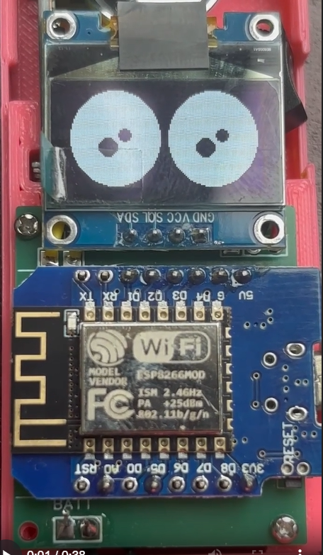

# 👁️ Expressive Robot Eyes - OLED Animation 👁️



> *Give your Arduino projects some personality with these hyperrealistic robot eyes!*

## 🤖 Overview

This project transforms a simple 0.96" OLED display into an expressive pair of robot eyes that react, blink, and display emotions. Perfect for your next robotics project, IoT device with a personality, or just a cool desk gadget that feels alive!

**Watch the eyes in action:**
[](https://youtu.be/YOUR_VIDEO_ID)

## ✨ Features

- **8 Distinct Expressions:** Neutral, Happy, Sad, Angry, Surprised, Sleepy, and directional gazes
- **Realistic Eye Movements:** Random blinking and looking patterns
- **Smooth Animations:** Fluid transitions between expressions using lerp interpolation
- **Optimized for 128x64 OLED:** Maximizes the entire display for an immersive effect
- **Plug & Play:** No configuration needed - upload and watch the magic happen

## 🛠️ Hardware Requirements

- ESP8266 (ESP-12E or Wemos D1 Mini)
- 0.96" I2C OLED Display (128x64 resolution, SSD1306)
- Micro USB cable for power and programming
- Optional: 3D printed enclosure or mounting solution

## 📋 Wiring Diagram

```
ESP8266         -->  OLED Display
VCC/3.3V        -->    VCC
GND             -->    GND
D1 (GPIO5/SCL)  -->    SCL
D2 (GPIO4/SDA)  -->    SDA
```

## 💻 Software Requirements

- Arduino IDE
- [U8g2 Library](https://github.com/olikraus/u8g2)
- Wire.h (built-in)

## 🚀 Installation

1. Connect your OLED display to your ESP8266 following the wiring diagram above
2. Install the U8g2 library through the Arduino Library Manager
3. Open `robot_face_menu.ino` in the Arduino IDE
4. Select your board and port
5. Upload the code
6. Watch your OLED come alive with personality!

## 🔍 How It Works

The code uses dynamic parameters for eye size, openness, pupil position, and highlight counts to create realistic eye expressions. The eyes automatically cycle through different emotions while randomly blinking and looking around.

Key components:
- **Smooth Animation Engine:** Uses linear interpolation (lerp) for fluid transitions
- **Randomized Behaviors:** Natural blinking and gaze patterns
- **Expression System:** Easily configurable emotion parameters

## 🎮 Customization

Want to create your own expressions? Modify the `setEyeExpression()` function to adjust:

- Eye width and height
- Openness (for squinting/widening) 
- Pupil offsets (for looking directions)
- Highlight count and positions
- Blinking frequency

## 📚 Code Explanation

The animation system uses a target-current approach:
1. Each expression sets target values for eye parameters
2. The animation loop smoothly interpolates current values toward targets
3. Blinking and looking functions add natural randomized movements

## 🔧 Advanced Usage

You can extend this project by:
- Adding external triggers for expressions (sensors, buttons)
- Combining with speech/sound for a complete interactive experience
- Integrating with a larger robot body
- Adding additional eye details for more complex emotions

## 🌟 Portfolio Project

This expressive robot eyes animation is part of my portfolio of interactive electronic projects. It demonstrates:
- Animation techniques in constrained environments
- Personality creation through minimal visual cues
- Real-time parameter interpolation for smooth motion
- Efficient use of limited display resolution

### 🚀 More Projects Coming Soon!

Stay tuned for these exciting upcoming projects:

| Project | Description | Status |
|---------|-------------|--------|
| **Smart Home Assistant** | Voice-controlled home automation system with custom wake word | 🔜 June 2025 |
| **AI-Enhanced Weather Station** | Forecast local microclimate with ML prediction | 🔜 July 2025 |
| **Gesture-Controlled Drone** | Custom firmware for hand gesture flight control | 🔜 August 2025 |
| **Interactive LED Art** | Sound-reactive wall installation with 3D-printed diffusers | 🔜 September 2025 |

👉 **[Full Portfolio](https://yourportfolio.com)** - Check back soon for updates!

## 📱 See It In Action

Here's what the robot eyes look like in real life:


The eyes automatically cycle through different expressions while displaying natural blinking and looking behaviors. Each eye is uniquely rendered with highlights that create the illusion of depth and personality.

## ☕ Support My Work

If you found this project helpful or interesting:

[](https://trakteer.id/haadziq_fatkhiya/link)

Your support helps me continue creating and sharing open-source projects like this one!

## 📝 License

This project is licensed under the MIT License - see the LICENSE file for details.

## 📧 Contact

Have questions or suggestions? Feel free to:
- Open an issue on this repo
- Reach out on social media [@YourHandle](https://twitter.com/yourhandle)
- Visit my portfolio at [yourwebsite.com](https://yourwebsite.com)

---

**Note:** Remember to add a demo image to your repository and update the YouTube video link with your actual demo video once uploaded!"# robot-face-menu" 
